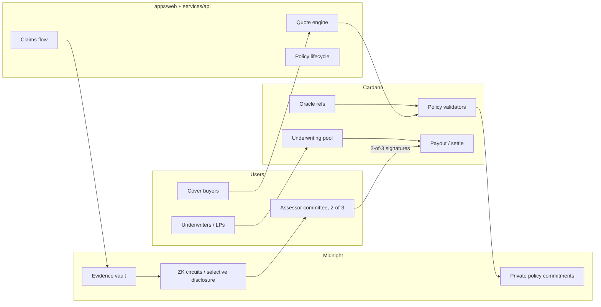

# Architecture

PlutusShield spans two chains and one application surface.

- **Cardano** — premiums, underwriting pool capital, policy lifecycle transitions, and payouts. Validators enforce money movement.
- **Midnight** — private policy terms, claims evidence, and underwriter positions. Compact circuits prove eligibility and claim validity without publishing sensitive data.
- **App + API** — quotes, wallet connect, policy management, and claims UX.

> Status: pre-testnet. The Cardano validators (`contracts/cardano`, Aiken, 92 tests, multi-asset ADA + USDC tranches, sale circuit-breaker, end-to-end emulator run; Preview runbook in `contracts/cardano/deploy`) and the Midnight policy registry (`contracts/midnight`, Compact) compile and pass local tests. Nothing is deployed or audited.

## System overview



## Privacy boundaries

| Data | Where it lives | Who sees it |
|---|---|---|
| Premium amount, pool TVL, payout events | Cardano (public) | Anyone |
| Policy coverage amount, protocol exposure, buyer identity commitments | Midnight (private by default) | Holder; selectively disclosed to assessors / auditors |
| Claims evidence (tx dumps, audit notes, exploit writeups) | Midnight evidence vault | Claimant + authorized assessors via disclosure proofs |
| Underwriter book / risk concentration | Midnight | Underwriter; optional aggregate proofs to governance |

Public Cardano state should never need private Midnight witnesses to verify that a payout was authorized — only that a valid proof / attestation was accepted.

## Layers (repo layout)

```
contracts/cardano/     Aiken validators: pool, policy mint, settle        (built)
contracts/midnight/    Compact: policy commitment, evidence, disclosure   (built)
services/api/          Quotes, indexer, oracle relay hooks                (planned)
services/oracle-relay/ Multi-venue median TWAP + trigger eval + feed datums (built)
apps/web/              Marketing site + dApp                              (built: site, /cover quote)
packages/sdk/          Shared TS types, quote engine, Cardano datum codecs (built)
```

## Cardano on-chain layer

One parameterised multi-validator, `cover`, serves as both the minting policy and the lock script (see [contracts/cardano/README.md](../contracts/cardano/README.md)):

- **Pool UTxO** (pool NFT + capital, `PoolDatum { total_shares, active_cover }`). LPs deposit and withdraw against pro-rata LP share tokens. Withdrawals can't push utilization above the product cap, so active cover stays fully collateralized.
- **Buy.** The buyer pays a premium into the pool, at or above an integer floor that mirrors the SDK quote engine. The buy mints a reference token (locked with `PolicyDatum`) and a user token (to the buyer). `policy_id = blake2b_256(cbor(pool input))`, the same 32-byte id the Midnight registry uses. `midnight_commitment` carries the buyer's Midnight registration commitment, `SHA-256("plutusshield:register:v1" ‖ policy_id ‖ holder ‖ coverage)`, derived in the browser from a private policy key that never goes on-chain (see `contracts/midnight/README.md`). **Sale circuit-breaker:** every allowlisted oracle feed must attach a fresh healthy-peg reading (unanimity, so a buyer can't omit the one showing a depeg), and cover starts only after `sale_guard.waiting_period_ms`. **Expire** refunds the policy UTxO's deposit to `PolicyDatum.refund_to` (the buyer), whoever submits it.
- **Settle.** The holder burns both tokens and the pool pays exactly `coverage`. Settlement requires that a quorum of reference inputs holding allowlisted oracle-feed NFTs attest TWAP < threshold for at least the window, entirely within `[start, expiry]`, and that the claim is filed within the grace period.
- **Expire.** After expiry plus grace, anyone can burn the reference token to release locked capital.
- **No admin key.** Product terms, oracle allowlist, quorum, and pool currency are validator parameters.

## MVP vs later

**MVP (first shippable product)**

1. Parametric stablecoin depeg cover on Cardano (multi-oracle trigger, pool-funded payout).
2. Minimal web: connect wallet → quote → buy → view policy status.
3. Midnight policy commitment that mirrors the Cardano policy id (prove you hold cover without revealing size).

**Later**

- Smart-contract exploit / hack cover with private evidence + assessor workflow.
- Protocol SLA cover.
- Partner SDK (embed “add insurance” in other Cardano DeFi flows).
- Mainnet capital only after external audit of both Cardano and Midnight contracts.

## Trust assumptions

- Oracle publishers are authenticated (NFT / VKH allowlists or equivalent).
- Midnight proof server and Compact circuits are correctly generated for deployed verifier keys.
- Assessors for non-parametric claims act as an **M-of-N committee** fixed in the exploit-cover script parameters (2-of-3 live on Cardano Preview, pool v2): an exploit `Settle` needs `threshold` distinct committee signatures, so no single key can release capital, and one lost or compromised key can be outvoted. Their authority is scoped by contract (exact coverage, policy tokens burned, claim window), not by a hot wallet with blanket admin rights. Today the three Preview keys are team-run; independent operators and governance-selected rotation (a new pool per committee change, since the committee is a script parameter) come before mainnet. On Midnight, `resolveClaim` is still one assessor role key; it can mark a claim PAID but can't move Cardano capital without the committee.
