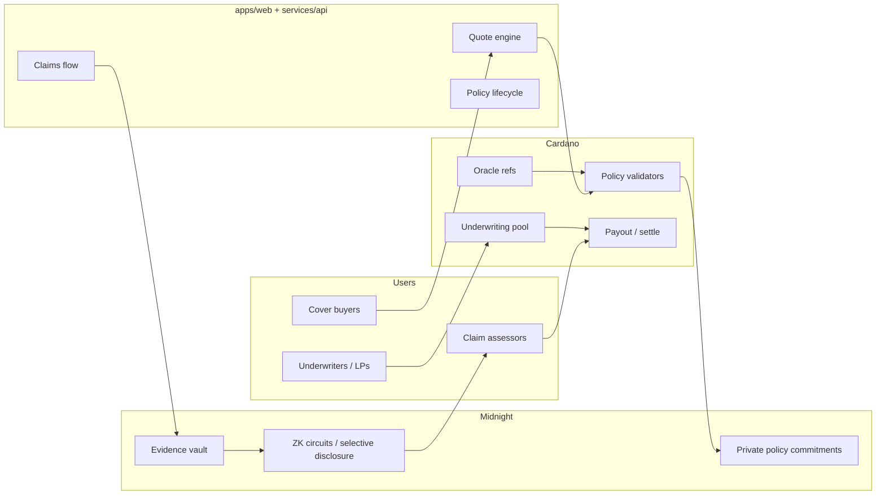

# Architecture

PlutusShield spans two chains and one application surface.

- **Cardano** — premiums, underwriting pool capital, policy lifecycle transitions, and payouts. Validators enforce money movement.
- **Midnight** — private policy terms, claims evidence, and underwriter positions. Compact circuits prove eligibility and claim validity without publishing sensitive data.
- **App + API** — quotes, wallet connect, policy management, and claims UX.

> Status: design. No contracts are deployed yet.

## System overview



## Privacy boundaries

| Data | Where it lives | Who sees it |
|---|---|---|
| Premium amount, pool TVL, payout events | Cardano (public) | Anyone |
| Policy coverage amount, protocol exposure, buyer identity commitments | Midnight (private by default) | Holder; selectively disclosed to assessors / auditors |
| Claims evidence (tx dumps, audit notes, exploit writeups) | Midnight evidence vault | Claimant + authorized assessors via disclosure proofs |
| Underwriter book / risk concentration | Midnight | Underwriter; optional aggregate proofs to governance |

Public Cardano state should never need private Midnight witnesses to verify that a payout was authorized — only that a valid proof / attestation was accepted.

## Layers (planned repo layout)

```
contracts/cardano/     Aiken validators: pool, policy mint, settle
contracts/midnight/    Compact: policy commitment, evidence, disclosure
services/api/          Quotes, indexer, oracle relay hooks
services/oracle-relay/ Multi-oracle aggregation + trigger eval
apps/web/              Marketing site + dApp
packages/sdk/          Shared TS types / client
```

## MVP vs later

**MVP (first shippable product)**

1. Parametric stablecoin depeg cover on Cardano (multi-oracle trigger, pool-funded payout).
2. Minimal web: connect wallet → quote → buy → view policy status.
3. Midnight policy commitment that mirrors the Cardano policy id (prove you hold cover without revealing size).

**Later**

- Smart-contract exploit / hack cover with private evidence + assessor workflow.
- Protocol SLA cover.
- Partner SDK (embed “add insurance” in other Cardano DeFi flows).
- Mainnet capital only after external audit of both Cardano and Midnight contracts.

## Trust assumptions

- Oracle publishers are authenticated (NFT / VKH allowlists or equivalent).
- Midnight proof server and Compact circuits are correctly generated for deployed verifier keys.
- Assessors for non-parametric claims are governance-selected and can be rotated; their authority is scoped by contract, not by a hot wallet with blanket admin rights.
